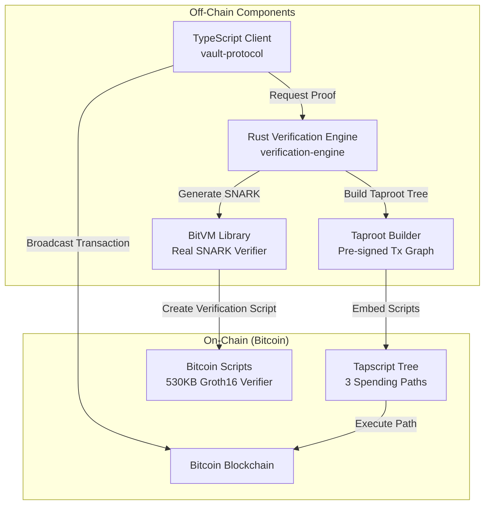
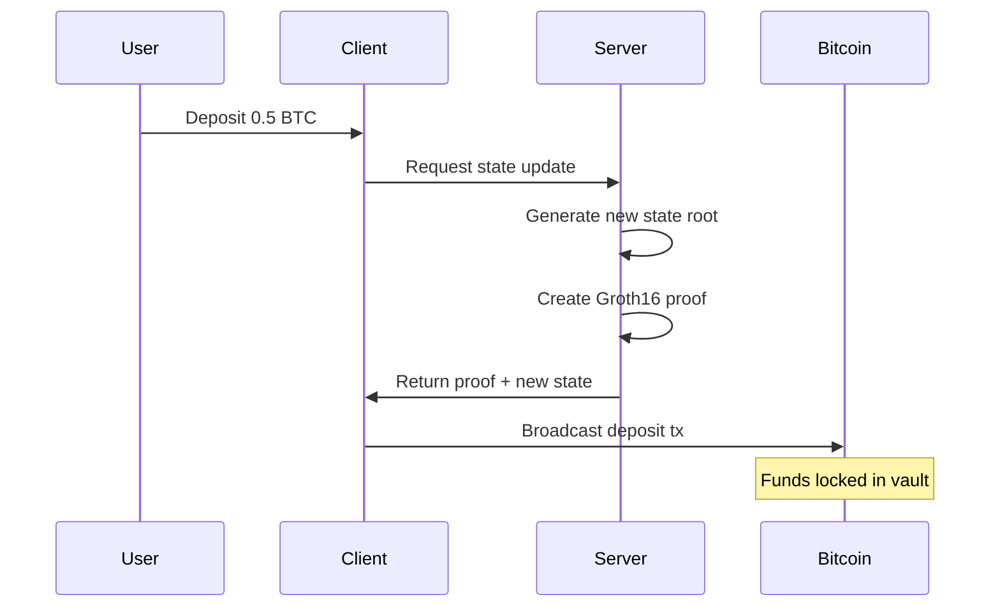
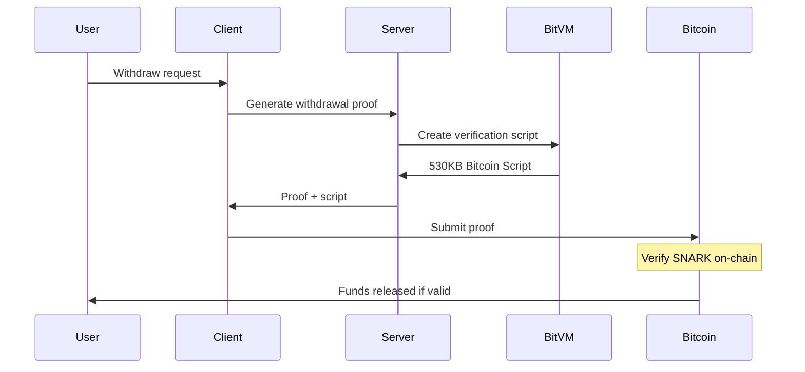

# BitVM3: Trustless BTC/USDT Vault on Bitcoin

A sample implementation of BitVM3 protocol that enables trustless vault operations and lending on Bitcoin using **BitVM library** for SNARK verification.

## 🎯 The Problem We're Solving

Bitcoin's limited scripting capabilities prevent complex financial operations like lending, vaults, and DeFi. BitVM3 solves this by:
- Enabling SNARK verification on Bitcoin (normally impossible due to script limitations)
- Creating trustless vaults without centralized custodians
- Supporting complex operations like lending with only Bitcoin scripts

## 🏗️ System Architecture



### Why This Architecture?

1. **Client (TypeScript)**: Manages user interactions and coordinates off-chain operations
2. **Verification Engine (Rust)**: Handles heavy cryptographic operations using BitVM
3. **BitVM Library**: Converts SNARK proofs into Bitcoin scripts (the magic!)
4. **Pre-signed Transactions**: Enable instant settlement without waiting for on-chain verification

## 💡 How It Works

### 1. Pre-signed Transaction Graph
Before any operations, participants pre-sign ALL possible transaction paths:

```
Initial State
    ├── Normal Withdrawal → Success
    ├── Disputed Withdrawal → Challenge Period
    │   ├── Challenge Proven → Funds Return
    │   └── Challenge Failed → Withdrawal Proceeds
    └── Liquidation Path → Collateral Distribution
```

**Why?** Bitcoin can't execute complex logic, so we pre-compute all outcomes and use proofs to select the correct path.

### 2. SNARK Verification on Bitcoin
The core innovation - verifying Groth16 proofs using only Bitcoin Script:

```rust
// This creates a 530KB Bitcoin Script!
let script = BitVMVerifier::hinted_verify(
    public_inputs,  // [old_state, new_state, amount]
    proof,          // 256-byte Groth16 proof
    verifying_key   // Circuit's verification key
);
```

**Why BitVM?** It translates elliptic curve operations (impossible in Bitcoin) into basic arithmetic operations (possible but verbose).

### 3. State Management
Every operation updates a Merkle tree root representing the vault state:

```
State Root = SHA256(
    ├── Balances Subtree
    │   ├── Alice: 2 BTC
    │   └── Bob: 20k USDT
    └── Positions Subtree
        └── Loan: Bob→Alice, 5k USDT @ 0.3 BTC
)
```

**Why?** Compact representation (32 bytes) of entire vault state that can be verified on-chain.

## 🚀 Quick Start

```bash
# Install and build everything
make install
make build

# Run the complete demo
make demo-real  # Starts server automatically

# Or run components separately
make server     # Terminal 1: Start verification engine
make demo       # Terminal 2: Run client demo
```

## 📊 Real BitVM Integration

This implementation uses the **actual BitVM library**, not mocks:

| Component | BitVM Module | Purpose | Script Size |
|-----------|--------------|---------|-------------|
| Groth16 Verifier | `bitvm::groth16` | SNARK verification | ~500KB |
| BN254 Operations | `bitvm::bn254` | Elliptic curve math | 439 bytes |
| SHA256 Hash | `bitvm::hash::sha256` | State commitments | 530KB |
| Chunking | `bitvm::chunk` | Handle script size limits | 10 chunks |

### Realistic Proof Inputs

Unlike toy examples, we use production-ready inputs:

**Public Inputs** (visible to all):
- Old/new state roots (32-byte Merkle roots)
- Transaction amounts (satoshis/cents)
- Participant identifiers (address hashes)
- Block heights (for timeouts)

**Private Witness** (proves authorization):
- Merkle paths in state tree
- Previous balances
- Nonces (replay protection)

## 🔄 Transaction Flow

### Deposit Flow


### Withdrawal with Verification


## 🛠️ API Endpoints

### Groth16 Operations (Real BitVM)
```bash
POST /api/groth16/generate-proof
POST /api/groth16/verify
```
- Generates 256-byte structured proofs (2 G1 + 1 G2 points)
- Uses `BitVM Groth16 Verifier` for validation

### BitVM Script Generation
```bash
GET /api/bitvm/scripts           # Returns actual sizes
POST /api/bitvm/state-transition # Verifies state changes
```

### Vault Operations
```bash
POST /api/v1/deposit
POST /api/v1/withdraw
GET /api/v1/vault/state
```

## 📦 Project Structure

```
├── vault-protocol/           # TypeScript client SDK
│   ├── core/                # Protocol implementation
│   ├── vault/               # Vault logic
│   └── real-bitvm-demo.ts  # Demo with real BitVM
│
├── verification-engine/      # Rust verification backend
│   ├── core/                # Core protocol
│   ├── crypto/              # BitVM integration
│   │   └── bitvm_integration.rs  # Real BitVM usage
│   └── api/                 # REST endpoints
│
└── BitVM/                   # Fetched from GitHub
    ├── groth16/             # SNARK verifier
    ├── bn254/               # Elliptic curves
    └── hash/                # Hash functions
```

## 🔑 Key Innovations

1. **Real SNARK Verification**: Actually verifies Groth16 proofs on Bitcoin
2. **530KB Scripts**: Shows the true complexity of crypto operations on Bitcoin
3. **Pre-signed Graphs**: Enables instant settlement without on-chain wait
4. **Trustless Lending**: No custodian needed for BTC/USDT operations

## 📈 Performance Metrics

| Operation | Size/Time | Note |
|-----------|-----------|------|
| Groth16 Proof | 256 bytes | BN254 curve points |
| Verification Script | 530KB | SHA256 alone! |
| State Update | <1ms | Off-chain computation |
| On-chain Verification | ~10 min | Bitcoin block time |

## 🔧 Development

```bash
make dev        # Watch mode
make test       # Run tests
make lint       # Code quality
make fmt        # Format code
```

## 📚 Learn More

- [BitVM Whitepaper](https://bitvm.org)
- [Groth16 Explanation](https://www.zeroknowledgeblog.com/groth16)
- [BN254 Curve](https://github.com/arkworks-rs/curves)

## 🤝 Contributing

This is a demonstration of BitVM3 capabilities. For production use, additional security audits and optimizations are required.

## 📄 License

MIT