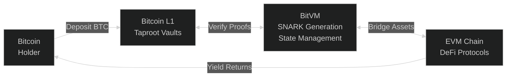

# BitVM3: Trustless Bitcoin DeFi Vaults

Enabling DeFi for Bitcoin holders through trustless multi-party vaults powered by BitVM's SNARK verification.

## 🎯 Overview: DeFi for Bitcoin

**The Problem**: Bitcoin holders can't access DeFi yields without trusting centralized exchanges or wrapping services. Bitcoin's limited scripting prevents complex financial operations like lending, borrowing, and yield farming from running natively.

**Our Solution**: BitVM3 creates trustless vaults where BTC holders can:
- Use BTC as collateral for loans without custodians
- Access DeFi yields while maintaining Bitcoin security
- Execute complex financial operations verified on Bitcoin L1
- Participate in lending markets without wrapping BTC

## 🏗️ System Architecture



## 📊 Primary Use Case: Leveraged Yield Farming

### How It Works

```mermaid
%%{init: {'theme':'dark'}}%%
sequenceDiagram
    participant User as BTC Holder
    participant BTC as Bitcoin L1
    participant BitVM as BitVM Layer<br/>(Off-chain)
    participant Bridge as Bridge<br/>(Off-chain)
    participant EVM as EVM Chain
    participant DeFi as Aave/Compound

    Note over User,DeFi: Leveraged Yield Farming Flow
    
    rect rgb(40, 40, 40)
        Note left of User: 1. Deposit Collateral
        User->>BTC: Deposit 2 BTC ($100k)
        BTC->>BitVM: Lock in Taproot vault
        BitVM->>BitVM: Generate vault state
    end

    rect rgb(40, 40, 40)
        Note left of User: 2. Borrow Against Collateral
        User->>BitVM: Request $50k USDT loan
        BitVM->>BitVM: Verify collateral ratio
        BitVM->>BitVM: Generate SNARK proof
        BitVM->>Bridge: Initiate bridge transfer
        Bridge->>EVM: Mint wrapped BTC claim
        EVM->>User: Transfer $50k USDT
    end

    rect rgb(40, 40, 40)
        Note left of User: 3. Deploy to Yield Protocol
        User->>EVM: Approve USDT spending
        EVM->>DeFi: Deposit USDT
        DeFi->>DeFi: Generate 8-15% APY
        DeFi->>User: Accrue yield tokens
    end

    rect rgb(40, 40, 40)
        Note left of User: 4. Monitor & Liquidation (if needed)
        BitVM->>BitVM: Monitor health ratio
        alt Health Ratio < 1.5
            BitVM->>BitVM: Trigger liquidation
            BitVM->>BTC: Execute pre-signed tx
            BTC->>Bridge: Release collateral
            Bridge->>EVM: Liquidator repays debt
        end
    end

    rect rgb(40, 40, 40)
        Note left of User: 5. Withdraw & Repay
        User->>DeFi: Withdraw position
        DeFi->>User: Return USDT + yield
        User->>EVM: Repay loan + interest
        EVM->>Bridge: Burn debt token
        Bridge->>BitVM: Generate repayment proof
        BitVM->>BTC: Unlock collateral
        BTC->>User: Return 2 BTC
    end
```



### Example Strategy
1. **Deposit**: 2 BTC as collateral ($100k)
2. **Borrow**: $50k USDT at 5% APR
3. **Deploy**: To Aave/Compound earning 8-9% APY
4. **Profit**: 3-4% net yield on $50k = $1,500-2,000/year
5. **Maintain**: BTC exposure while earning yield

## 🔧 Technical Architecture

### Why BitVM Enables This

BitVM provides the critical components that make trustless Bitcoin DeFi possible:

| BitVM Component | What It Does | How It Enables DeFi | Technical Details |
|-----------------|--------------|---------------------|-------------------|
| **Groth16 SNARK Verifier** | Verifies complex computations on Bitcoin L1 | Enables Bitcoin to verify DeFi operations (collateral ratios, interest calculations, liquidations) without executing them | 530KB script that can verify any computation compressed into a 256-byte proof |
| **Taproot Script Trees** | Creates pre-signed transaction paths | Allows multi-party vaults without custodians - each participant has their own pre-signed withdrawal/liquidation path | Pre-signed trees with conditions like "IF health < 1.5 AND liquidator pays debt THEN release BTC" |
| **Garbled Circuits** | Private multi-party computation | Keeps sensitive financial data private while still proving correctness (e.g., proving solvency without revealing positions) | Computes interest, collateral ratios, and liquidation triggers without exposing user balances |
| **State Machine** | Manages vault lifecycle off-chain | Coordinates cross-chain operations and generates proofs for state transitions | Tracks deposits, loans, yields, and liquidations across Bitcoin and EVM chains |
| **Bridge Integration** | Trustless cross-chain messaging | Enables BTC collateral to access EVM DeFi yields without wrapping through centralized services | Generates proofs that Bitcoin locked = EVM tokens minted, verified by BitVM |

**Key Innovation**: BitVM compresses ANY complex DeFi logic into a 256-byte proof that Bitcoin can verify with a 530KB script, bypassing Bitcoin's computational limitations while maintaining its security guarantees.

### Component Breakdown

#### 1. **Groth16 SNARK Verification** (530KB Scripts)
```rust
// Why we need it: Compress complex DeFi logic into Bitcoin-verifiable proofs
use bitvm::groth16::{g16, hinted};

// What it enables:
// - Verify collateral ratios (100KB logic → 256 byte proof)
// - Calculate compound interest (50KB math → 256 byte proof)
// - Process liquidations (80KB checks → 256 byte proof)
// - All verifiable on Bitcoin L1 within script size limits
```

#### 2. **Taproot Script Trees**
```rust
// Why we need it: Create multi-party vaults without intermediaries
use bitvm::treepp::*;

// Pre-signed transaction tree structure:
Vault Root
├── Normal Operations (2-of-3 multisig)
│   ├── Withdraw (borrower + verification)
│   ├── Repay (borrower + proof)
│   └── Yield claim (borrower + proof)
├── Liquidation Branches (health < 1.5)
│   ├── Liquidator 1 path
│   ├── Liquidator 2 path
│   └── Liquidator 3 path
└── Emergency Recovery (timelock + operators)
```

#### 3. **Garbled Circuits for Privacy**
```rust
// Why we need it: Private computation of sensitive financial data
use bitvm::garbled::*;

// Enables private:
// - Interest accrual without revealing positions
// - Collateral verification without exposing amounts
// - Liquidation checks without broadcasting health ratios
```

### Proof Compression Magic

BitVM compresses any vault operation into Bitcoin-verifiable proofs:

| DeFi Operation | Traditional Size | BitVM Proof | Verification Cost |
|----------------|------------------|-------------|-------------------|
| Collateral Check | ~100KB logic | 256 bytes | 530KB script |
| Interest Update | ~50KB math | 256 bytes | 530KB script |
| Liquidation | ~80KB state | 256 bytes | 530KB script |
| Yield Distribution | ~120KB calc | 256 bytes | 530KB script |

## ⚠️ Design Constraints & Solutions

### BitVM Limitations

Due to Bitcoin's pre-signed transaction model, vaults have these constraints:

**Fixed at Creation:**
- All participants (borrowers, operators, liquidators) must be pre-determined
- Cannot add new users after vault creation
- Cannot change operator multisig threshold
- Cannot add or remove liquidators
- Cannot modify collateral amounts in existing positions
- Cannot adjust loan terms after creation

**Operational Constraints:**
- Each vault requires pre-signed transaction trees
- New users require new vault creation
- Capital fragmentation across multiple vaults
- Higher on-chain transaction costs vs single pool model
- Liquidators must be trusted entities chosen upfront

**Solutions:**
- **Vault Factories**: Automate creation of dedicated vaults per user
- **Vault Composition**: Link multiple vaults at protocol layer
- **Professional Operators**: Dedicated services for liquidation and management

### Practical Architecture

Instead of one pool for all users (Aave model), we use isolated vaults:

```
User Request → Vault Factory → Dedicated Vault
                    ↓
            [Fixed Operators]
            [Fixed Liquidators]  
            [User as Borrower]
                    ↓
            BitVM Verification → Bitcoin L1
```

This maintains trustlessness while working within Bitcoin's constraints.

## 🚀 Quick Start

### Prerequisites
```bash
# Required: Node.js 18+, Rust 1.70+, Bitcoin Core 25+
make install  # Install all dependencies
make build    # Build TypeScript and Rust components
```

### Run Primary Demo
```bash
# Leveraged Yield Farming Demo
make demo-lending

# Full BitVM Integration
make demo-real

# All Demos
make demo-all
```

## 📦 Project Structure

```
vault-protocol/          # TypeScript vault implementation
├── src/
│   ├── vault/          # TrustlessVault core logic
│   ├── core/           # BitVM3 protocol integration
│   ├── crypto/         # SNARK and garbled circuits
│   └── demos/          # Example implementations
verification-engine/     # Rust BitVM integration
├── crates/
│   ├── crypto/         # Groth16 verifier implementation
│   ├── core/           # Bitcoin transaction management
│   └── vault/          # Vault-specific logic
contracts/              # Supporting smart contracts
```

## 🎯 Why This Matters

BitVM3 demonstrates that Bitcoin can support sophisticated DeFi operations without:
- Wrapping BTC on other chains
- Trusting centralized exchanges
- Compromising Bitcoin's security model
- Adding new opcodes to Bitcoin

While more constrained than EVM DeFi, it enables real yield opportunities for Bitcoin holders who want to maintain custody and security.

## 🔗 Resources

- [BitVM GitHub](https://github.com/BitVM/BitVM)
- [BitVM Whitepaper](https://bitvm.org/bitvm.pdf)
- [Technical Documentation](./verification-engine-guide.md)