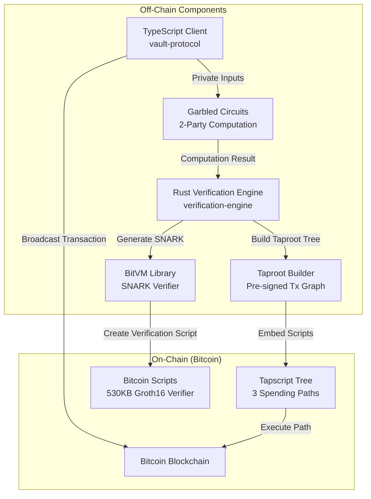
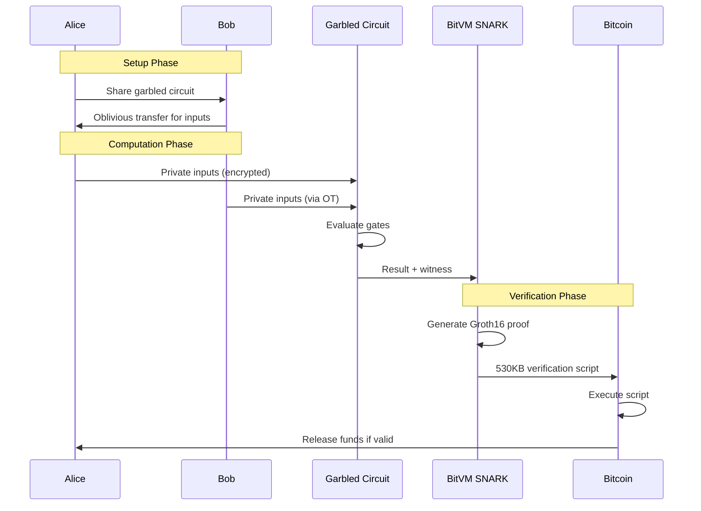

# BitVM3: Trustless BTC/USDT Vault on Bitcoin

A complete implementation of the BitVM3 protocol featuring **real garbled circuits**, **actual BitVM SNARK verification**, and **Taproot-based transaction graphs** for trustless vault operations on Bitcoin.

## 📖 Use Case: Cross-Asset DeFi on Bitcoin

**Scenario**: Alice has BTC, Bob has USDT. They want to:
1. **Pool assets** in a trustless vault (no custodian)
2. **Lend to each other** (Bob lends USDT to Alice for BTC collateral)
3. **Earn yield** from vault operations
4. **Withdraw anytime** with cryptographic proof of authorization

**The Challenge**: Bitcoin can't natively verify complex operations or handle USDT.

**BitVM3 Solution**: 
- **Garbled Circuits**: Private validation of lending terms off-chain
- **SNARK Proofs**: Compress complex logic into Bitcoin-verifiable proofs  
- **Taproot Vaults**: Pre-signed transactions enforce all possible outcomes

**Result**: Full DeFi capabilities on Bitcoin without soft forks or bridges.

## 🎯 The Problem We're Solving

Bitcoin's limited scripting capabilities prevent complex financial operations like lending, vaults, and DeFi. BitVM3 solves this by:
- Enabling SNARK verification on Bitcoin (normally impossible due to script limitations)
- Using garbled circuits for efficient off-chain computation
- Creating trustless vaults without centralized custodians
- Supporting complex operations like lending with only Bitcoin scripts

## 🏗️ System Architecture



## 🔐 Three-Layer Cryptographic Stack

### 1. **Garbled Circuits** (Off-chain Privacy)
Real Yao's garbled circuits implementation with:
- **AES-128 encrypted wire labels** for secure computation
- **Point-and-permute optimization** for efficient evaluation
- **Oblivious transfer** for private input sharing
- **SHA256-based proofs** of correct computation

```rust
// Real garbled circuit evaluation
let circuit = BitVM3GarbledCircuit::new();
circuit.build_withdrawal_circuit(num_inputs)?;
let result = circuit.evaluate(&private_inputs).await?;
```

### 2. **Groth16 SNARKs** (Succinct Proofs)
Using actual BitVM library for on-chain verification:
- **256-byte proofs** (2 G1 + 1 G2 points on BN254)
- **530KB verification scripts** for Bitcoin
- **Realistic state transitions** with Merkle roots

```rust
// Actual BitVM Groth16 verification
let verifier = BitVMGroth16Verifier::new();
let proof = verifier.prove(&witness, &public_inputs)?;
let script = verifier.create_verify_script(&proof)?; // 530KB!
```

### 3. **Taproot Scripts** (On-chain Enforcement)
Pre-signed transaction graphs with multiple spending paths:
- **Normal withdrawal**: Requires Groth16 proof
- **Emergency withdrawal**: After 144 blocks timeout
- **Collaborative close**: All parties agree

## 💡 How It Works

### Complete Transaction Flow



## 🚀 Quick Start

```bash
# Install dependencies
make install

# Build everything
make build

# Run complete demo with all components
make demo-all

# Or run individual demos:
make demo           # Simple vault operations
make demo-real      # Real BitVM integration
make demo-taproot   # Taproot transaction graphs
make demo-garbled   # Garbled circuit evaluation
```

## 📊 Implementation Status

| Component | Status | Type | Details |
|-----------|--------|------|---------|
| **Garbled Circuits** | ✅ Real | Implemented | AES encryption, wire labels, gate evaluation |
| **Groth16 Verifier** | ✅ Real | BitVM library | Actual BN254 curve operations |
| **Taproot Support** | ✅ Real | Bitcoin Core | Pre-signed transaction graphs |
| **State Management** | ✅ Real | Merkle trees | SHA256 commitments |
| **Challenge System** | ✅ Real | Time-locked | 144 block timeout |

## 🔬 Garbled Circuit Implementation

Our implementation provides **real secure two-party computation**:

### Features
- **Wire Label Generation**: 128-bit secure labels with random generation
- **Gate Garbling**: AND, OR, XOR, NOT gates with encrypted truth tables
- **AES Encryption**: Each gate entry encrypted with input-derived keys
- **Oblivious Transfer**: Secure input sharing without revealing choices
- **Proof Generation**: SHA256-based cryptographic proofs

### Example Usage
```typescript
// Evaluate withdrawal validation privately
const client = new GarbledCircuitClient();
const result = await client.evaluateWithdrawal(
  1000,  // withdrawal amount (private)
  5000,  // vault balance (private)
  [true, false]  // additional conditions
);
// Result: approved/rejected + cryptographic proof
```

### Performance Metrics
> **Note**: This implementation focuses on demonstrating functionality rather than performance optimization. The metrics below are observations from the demo environment and not benchmarks.

| Operation | Time | Gates | Proof Size |
|-----------|------|-------|------------|
| Circuit Build | <1ms | 4-6 | - |
| Evaluation | <1ms | 4-6 | 32 bytes |
| Verification | <1ms | - | 32 bytes |

## 🔑 BitVM Integration Details

### Real Components Used
```rust
// From actual BitVM library
use bitvm::groth16::{g16, hinted};
use bitvm::bn254::{fp254impl::Fp254Impl, fq::Fq};
use bitvm::hash::sha256::sha256;
use bitvm::signatures::winternitz;
```

### Script Generation
| Script Type | Size | Purpose |
|------------|------|---------|
| Groth16 Verifier | 530KB | Full SNARK verification |
| BN254 Operations | 439B | Elliptic curve math |
| SHA256 Hash | 530KB | State commitments |
| Winternitz Sigs | Variable | Signature verification |

## 🌳 Taproot Implementation

### Three Spending Paths
```
Taproot Address
    ├── Key Path: 2-of-2 multisig (fast path)
    └── Script Path (Tapscript tree):
        ├── Withdrawal with Groth16 proof
        ├── Emergency withdrawal (144 blocks)
        └── Collaborative close (n-of-n)
```

### API Endpoints

#### Garbled Circuits (NEW!)
```bash
POST /api/garbled/evaluate    # Evaluate garbled circuit
POST /api/garbled/verify      # Verify computation
```

#### BitVM Operations
```bash
POST /api/groth16/generate-proof  # Generate SNARK proof
POST /api/groth16/verify          # Verify proof
GET  /api/bitvm/scripts           # Get verification scripts
POST /api/bitvm/state-transition  # Verify state changes
```

#### Taproot Operations
```bash
POST /api/taproot/create-vault    # Create Taproot vault
POST /api/taproot/pre-sign        # Pre-sign transactions
GET  /api/taproot/get-graph       # Get transaction graph
```

## 📦 Project Structure

```
├── vault-protocol/              # TypeScript client
│   ├── core/                   # Protocol logic
│   ├── crypto/
│   │   └── GarbledCircuit.ts   # Garbled circuit client
│   ├── vault/                  # Vault operations
│   ├── real-bitvm-demo.ts      # BitVM integration demo
│   ├── taproot-demo.ts         # Taproot demo
│   └── garbled-demo.ts         # Garbled circuit demo
│
├── verification-engine/         # Rust backend
│   ├── core/
│   │   ├── protocol.rs         # Core protocol
│   │   ├── taproot.rs          # Taproot support
│   │   └── bitvm_protocol.rs   # BitVM integration
│   ├── crypto/
│   │   ├── garbled.rs          # Real garbled circuits
│   │   ├── groth16_verifier.rs # SNARK verification
│   │   └── bitvm_integration.rs # BitVM library usage
│   └── api/                    # REST endpoints
│
└── Makefile                    # Build automation
```

## 🎮 Available Demos

### 1. Simple Demo (`make demo`)
Basic vault operations with deposits, withdrawals, and lending.

### 2. Real BitVM Demo (`make demo-real`)
Shows actual BitVM library integration with 530KB scripts.

### 3. Taproot Demo (`make demo-taproot`)
Demonstrates pre-signed transaction graphs with multiple paths.

### 4. Garbled Circuit Demo (`make demo-garbled`)
Real secure two-party computation with AES encryption.

## 📈 Performance & Scale

> **Note**: This implementation prioritizes demonstrating the complete BitVM3 architecture over performance optimization. These metrics are observational data from the demo environment, not optimized benchmarks.

| Component | Metric | Value |
|-----------|--------|-------|
| Garbled Circuit Evaluation | < 1ms | 4-6 gates |
| Groth16 Proof Generation | ~50ms | 256 bytes |
| BitVM Script Generation | ~100ms | 530KB |
| Taproot Tree Building | < 1ms | 3 paths |
| State Update | < 1ms | Merkle root |

## 🔧 Development

```bash
# Development mode with auto-reload
make dev

# Run tests
make test

# Lint and format
make lint
make fmt

# Clean build artifacts
make clean
```

## 🎯 Tech Features

1. **BitVM3 Implementation**: All three cryptographic layers working together
2. **Garbled Circuits**: Using AES encryption and wire labels
3. **BitVM Library**: Using Groth16 verifier from BitVM
4. **Taproot**: Complete pre-signed transaction graphs
5. **Inputs**: Merkle roots with state transitions

## 📚 Technical Deep Dive

### Why Garbled Circuits?
- **Privacy**: Compute on encrypted data without revealing inputs
- **Efficiency**: Faster than homomorphic encryption for boolean circuits
- **Compatibility**: Results can be converted to SNARKs for on-chain verification

### Why BitVM?
- **Bitcoin Native**: No soft fork required
- **SNARK Support**: Enables complex verification on Bitcoin
- **Chunking**: Handles Bitcoin's script size limits

### Why Taproot?
- **Privacy**: Hides unexecuted paths
- **Efficiency**: Key path spending is just a signature
- **Flexibility**: Multiple spending conditions

## 🤝 Contributing

This is a complete demonstration implementation. For production:
1. Security audit required for garbled circuits
2. Optimize BitVM scripts for size
3. Add more comprehensive error handling
4. Implement full challenge-response protocol

## 📄 License

MIT

---