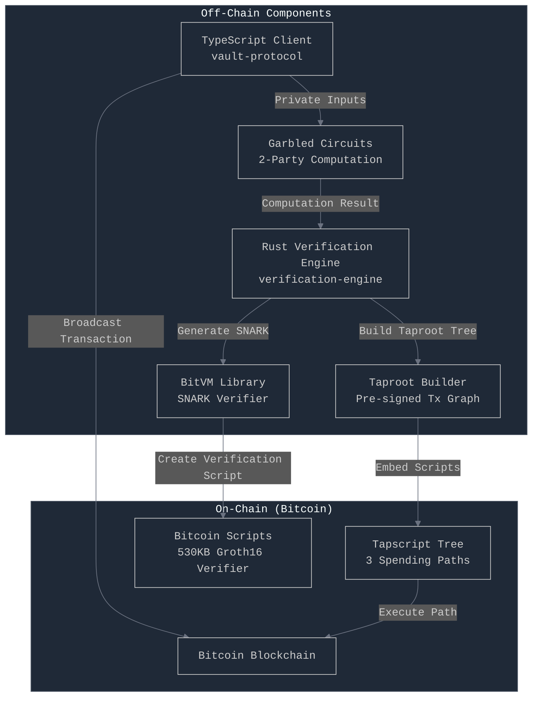
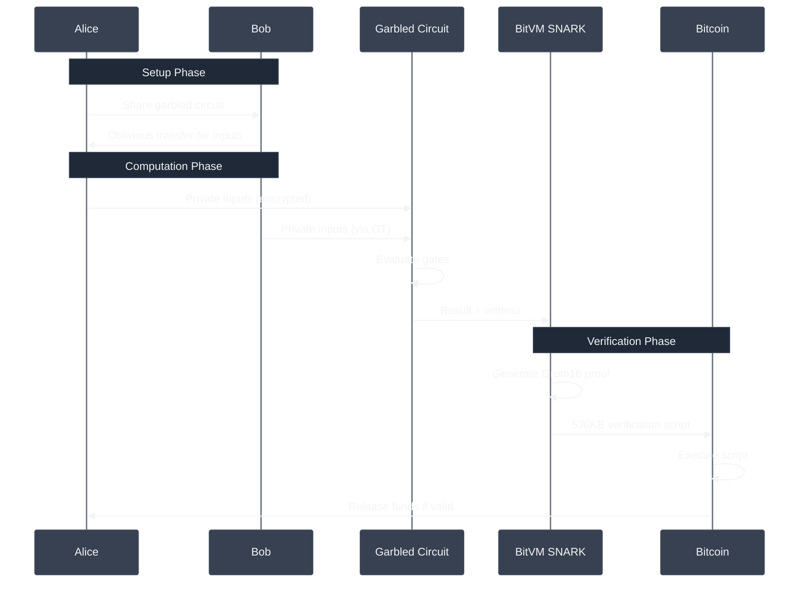

# BitVM3: Trustless BTC/USDT Vault on Bitcoin

An implementation of the BitVM3 protocol featuring **garbled circuits**, **BitVM SNARK verification**, and **Taproot-based transaction graphs** for trustless vault operations on Bitcoin.

## 📖 Use Case: Cross-Asset DeFi on Bitcoin

**Scenario**: Alice has BTC, Bob has USDT. They want to:
1. **Pool assets** in a trustless vault (no custodian)
2. **Lend to each other** (Bob lends USDT to Alice for BTC collateral)
3. **Earn yield** from vault operations
4. **Withdraw anytime** with cryptographic proof of authorization

**The Challenge**: Bitcoin can't natively verify complex operations or handle USDT.

**BitVM3 Solution**: 
- **Garbled Circuits**: Private validation of lending terms off-chain
- **SNARK Proofs**: Compress complex logic into Bitcoin-verifiable proofs  
- **Taproot Vaults**: Pre-signed transactions enforce all possible outcomes

**Result**: Full DeFi capabilities on Bitcoin without soft forks or bridges.

## 🏗️ System Architecture



## 🔐 Three-Layer Cryptographic Stack

### 1. **Garbled Circuits** (Off-chain Privacy)

> **Why:** Alice and Bob need to validate lending terms (interest rates, collateral ratios) without revealing their private financial positions to each other.
> 
> **How it helps:** Garbled circuits allow them to jointly compute whether a loan is acceptable based on private inputs (balances, risk parameters) without either party learning the other's data. Only the result (approved/rejected) is revealed.

Yao's garbled circuits implementation with:
- **AES-128 encrypted wire labels** for secure computation
- **Point-and-permute optimization** for efficient evaluation
- **Oblivious transfer** for private input sharing
- **SHA256-based proofs** of correct computation

```rust
// Garbled circuit evaluation
let circuit = BitVM3GarbledCircuit::new();
circuit.build_withdrawal_circuit(num_inputs)?;
let result = circuit.evaluate(&private_inputs).await?;
```

### 2. **Groth16 SNARKs** (Succinct Proofs)

> **Why:** Bitcoin's script size limit (520 bytes per element, ~4MB per transaction) makes it impossible to verify complex computations directly.
> 
> **How it helps:** SNARKs compress the entire vault state transition (deposits, withdrawals, lending operations) into a 256-byte proof that Bitcoin can verify. This enables complex DeFi logic that would otherwise require gigabytes of script.

Using BitVM library for on-chain verification:
- **256-byte proofs** (2 G1 + 1 G2 points on BN254)
- **530KB verification scripts** for Bitcoin
- **State transitions** with Merkle roots

```rust
// BitVM Groth16 verification
let verifier = BitVMGroth16Verifier::new();
let proof = verifier.prove(&witness, &public_inputs)?;
let script = verifier.create_verify_script(&proof)?; // 530KB!
```

### 3. **Taproot Scripts** (On-chain Enforcement)

> **Why:** Participants need guarantees that funds can be recovered even if other parties become unresponsive or malicious.
> 
> **How it helps:** Pre-signed transaction graphs create multiple "escape hatches" - if Bob disappears, Alice can withdraw via emergency path after timeout. If someone cheats, the challenge path activates. This ensures funds are never permanently locked.

Pre-signed transaction graphs with multiple spending paths:
- **Normal withdrawal**: Requires Groth16 proof
- **Emergency withdrawal**: After 144 blocks timeout
- **Collaborative close**: All parties agree

## 💡 How It Works

### Complete Transaction Flow



## 🚀 Quick Start

```bash
# Install and build
make install
make build

# Run the complete demo
make demo-all        # Runs all demos sequentially
```

### Available Demos

| Demo | Command | Description |
|------|---------|-------------|
| **Simple** | `make demo` | Basic vault operations with deposits/withdrawals |
| **BitVM** | `make demo-real` | BitVM integration with 530KB verification scripts |
| **Taproot** | `make demo-taproot` | Pre-signed transaction graphs with multiple paths |
| **Garbled** | `make demo-garbled` | Secure two-party computation with AES encryption |
| **Regtest** | `make demo-regtest` | Full demo with actual Bitcoin transactions |

### 🔗 Bitcoin Regtest Demo

The most comprehensive demo runs on a local Bitcoin network:

```bash
make demo-regtest    # Automatically starts Bitcoin node and runs full demo
```

This demonstrates:
- Creating Taproot vaults on Bitcoin (regtest)
- Broadcasting and confirming transactions  
- Funding vaults with actual BTC
- Verifying transactions on-chain

For manual control:
```bash
make regtest-start                  # Start Bitcoin node
make regtest-cli ARGS="getbalance"  # Run Bitcoin CLI commands
make regtest-stop                   # Stop Bitcoin node
```

## 📊 Implementation Status

| Component | Status | Type | Details |
|-----------|--------|------|---------|
| **Garbled Circuits** | ✅ | Implemented | AES encryption, wire labels, gate evaluation |
| **Groth16 Verifier** | ✅ | BitVM library | BN254 curve operations |
| **Taproot Support** | ✅ | Bitcoin Core | Pre-signed transaction graphs |
| **State Management** | ✅ | Merkle trees | SHA256 commitments |
| **Challenge System** | ✅ | Time-locked | 144 block timeout |

## 📋 Example Usage

### Garbled Circuit (Private Computation)
```typescript
// Evaluate withdrawal validation privately
const client = new GarbledCircuitClient();
const result = await client.evaluateWithdrawal(
  1000,  // withdrawal amount (private)
  5000,  // vault balance (private)
  [true, false]  // additional conditions
);
// Result: approved/rejected + cryptographic proof
```

## 🔑 BitVM Integration Details

### Components Used
```rust
// From BitVM library
use bitvm::groth16::{g16, hinted};
use bitvm::bn254::{fp254impl::Fp254Impl, fq::Fq};
use bitvm::hash::sha256::sha256;
use bitvm::signatures::winternitz;
```

### Script Generation
| Script Type | Size | Purpose |
|------------|------|---------|
| Groth16 Verifier | 530KB | Full SNARK verification |
| BN254 Operations | 439B | Elliptic curve math |
| SHA256 Hash | 530KB | State commitments |
| Winternitz Sigs | Variable | Signature verification |

## 📡 API Endpoints

```bash
# Garbled Circuits
POST /api/garbled/evaluate        # Evaluate garbled circuit
POST /api/garbled/verify          # Verify computation

# BitVM Operations  
POST /api/groth16/generate-proof  # Generate SNARK proof
POST /api/groth16/verify          # Verify proof
GET  /api/bitvm/scripts           # Get verification scripts
POST /api/bitvm/state-transition  # Verify state changes

# Taproot Operations
POST /api/taproot/create-vault    # Create Taproot vault
POST /api/taproot/pre-sign        # Pre-sign transactions
GET  /api/taproot/get-graph       # Get transaction graph
```

## 📦 Project Structure

```
├── vault-protocol/              # TypeScript client
│   ├── core/                   # Protocol logic
│   ├── crypto/
│   │   └── GarbledCircuit.ts   # Garbled circuit client
│   ├── vault/                  # Vault operations
│   ├── real-bitvm-demo.ts      # BitVM integration demo
│   ├── taproot-demo.ts         # Taproot demo
│   └── garbled-demo.ts         # Garbled circuit demo
│
├── verification-engine/         # Rust backend
│   ├── core/
│   │   ├── protocol.rs         # Core protocol
│   │   ├── taproot.rs          # Taproot support
│   │   └── bitvm_protocol.rs   # BitVM integration
│   ├── crypto/
│   │   ├── garbled.rs          # Garbled circuits
│   │   ├── groth16_verifier.rs # SNARK verification
│   │   └── bitvm_integration.rs # BitVM library usage
│   └── api/                    # REST endpoints
│
└── Makefile                    # Build automation
```


## 📈 Performance & Scale

> **Note**: This implementation prioritizes demonstrating the complete BitVM3 architecture over performance optimization. These metrics are observational data from the demo environment, not optimized benchmarks.

| Component | Metric | Value |
|-----------|--------|-------|
| Garbled Circuit Evaluation | < 1ms | 4-6 gates |
| Groth16 Proof Generation | ~50ms | 256 bytes |
| BitVM Script Generation | ~100ms | 530KB |
| Taproot Tree Building | < 1ms | 3 paths |
| State Update | < 1ms | Merkle root |

## 🔧 Development

```bash
# Development mode with auto-reload
make dev

# Run tests
make test

# Lint and format
make lint
make fmt

# Clean build artifacts
make clean
```


## 📄 License

MIT