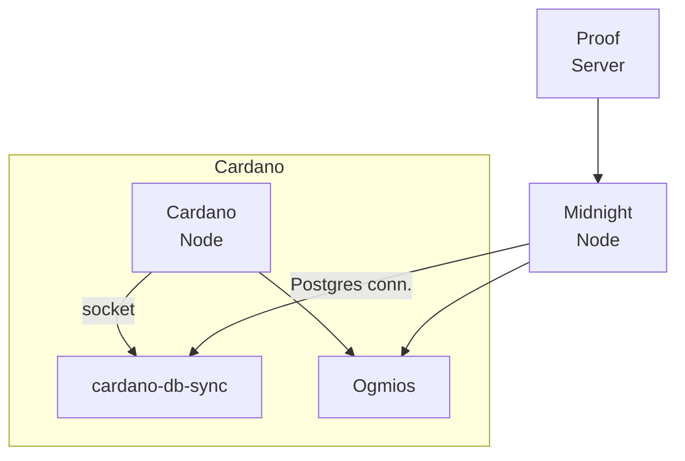

# Midnight Validator Helm Chart – Overview

This document provides a high-level walkthrough of the **midnight-mnn-helm** repository.  The chart automates "Step 2 – Run a validator node" of the official Midnight documentation (https://docs.midnight.network/validate/run-a-validator/step-2) by packaging everything required to operate a Midnight validator – together with its Cardano partner-chain stack – into a single Helm release.

---

## 1. What gets deployed?

The chart spins up the following Kubernetes **Deployments**, **Services** and **PersistentVolumeClaims** (PVCs):

| Component | Purpose | Kubernetes objects |
|-----------|---------|--------------------|
| **Midnight Node** | Runs the `midnightnetwork/midnight-node` binary and participates in consensus.  Exposes P2P (30333), WebSocket RPC (9944) and Prometheus (9615) ports. | Deployment + Service, PVC `midnight-data`, PVC `node-data` |
| **Cardano Node** | A full Cardano partner-chain node (`ghcr.io/intersectmbo/cardano-node`).  Provides the local ledger state required by Midnight. | Deployment + Service, PVC `*-cardano-data`, shared PVC `*-node-ipc` (socket) |
| **PostgreSQL** | Backend DB for cardano-db-sync.  A random password and connection string are stored in a Secret when `postgres.generatePassword=true`. | Deployment + Service, PVC `*-postgres-data` |
| **Cardano DB-Sync** | Ingests data from Cardano node into Postgres.  Waits for Postgres readiness and mounts a generated `pgpass` file. | Deployment, PVC `*-db-sync-data`, shared PVC `*-node-ipc` |
| **Ogmios** | Lightweight JSON-WS bridge to Cardano node. Useful for tooling and proof-server. | Deployment + Service, PVC `*-ogmios-data`, shared PVC `*-node-ipc` |
| **Proof Server** | Provides zero-knowledge proof services required by Midnight smart-contracts (`midnightnetwork/proof-server`). | Deployment + Service |
| **Config & Secrets** | – `chain-config` ConfigMap holding `pc-chain-config.json`  
 – Optional Secret with freshly generated node key  
 – Secret with Postgres credentials | ConfigMap, Secret(s) |

**Note:** In the original docker-compose setup these services share a `cardano-ipc` volume.  The Helm chart recreates this pattern with a PVC named `<release>-node-ipc` that is mounted by Cardano Node, cardano-db-sync and Ogmios.

A simplified dependency graph:



---

## 2. Helm values that matter

All configuration resides in `values.yaml`.  The most commonly tuned sections are:

1. **replicaCount** – keep at 1, validators must be unique.
2. **key** – set `generate: true` to auto-generate a 32-byte node key, or provide `existingKey`.
3. **midnightNode / cardanoNode / …** – per-container image tags, resources, extra args, ports.
4. **global.network** – `preview`, `preprod`, or `mainnet` (defaults to `preview`).
5. **persistence** – enable/disable PVCs, sizes & StorageClass.
6. **serviceAccount / securityContext / networkPolicy** – hardening knobs.

For a full list run:
```bash
helm show values . > values-full.yaml
```

---

## 3. Deployment summary
See **README.md** for installation, upgrade and uninstall commands.  This document focuses on architecture, configuration surfaces and operational internals rather than step-by-step usage.

---

## 4. Security & secret handling

• Node key: stored in an **Opaque** Secret if generated; otherwise loaded as plaintext value and **not** base-64-encoded automatically – make sure you manage it securely.
• Postgres: password is randomised (16 chars) and included in a connection-string field for convenience.
• Images are pinned to explicit tags – review and bump regularly.

---

## 5. Extending the chart

*Add Cardano SPO setup*:  Only Midnight-specific pieces are currently templated.  You can add SPO tooling (KES/OPCERT rotation, CNCLI leader-log, etc.) by introducing additional templates or pulling in existing community charts.

*Multi-validator topology*:  Generally discouraged – Midnight expects one validator per SPO identity.  If you do need redundancy, explore topology with **PodDisruptionBudgets** or **StatefulSets** and shared node keys.

*NetworkPolicy*:  Disabled by default – turn on and restrict egress/ingress once you know peer addresses.

---

## 6. Useful links

* Official docs Step 2 – Run a validator: <https://docs.midnight.network/validate/run-a-validator/step-2>
* Upstream docker-compose reference: <https://github.com/midnightntwrk/midnight-node-docker>
* Cardano node & db-sync images: <https://github.com/IntersectMBO/cardano-node>, <https://github.com/IntersectMBO/cardano-db-sync>

---

© 2024 11tech.xyz – Licensed under MIT 